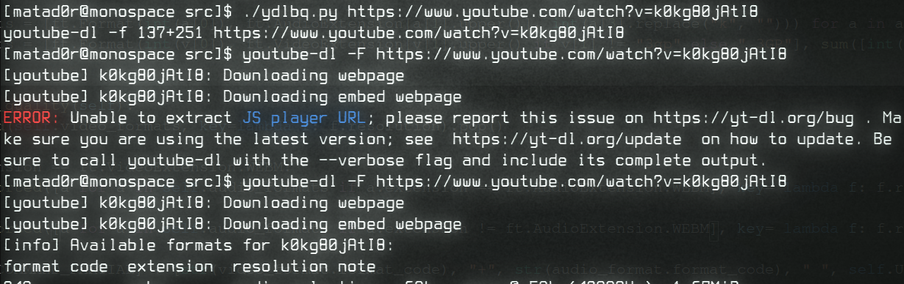

# ydlbq
#### Előállítja azt a parancsot amivel a lehető legjobb minőségben tudjuk letölteni az adott YouTube videót `youtube-dl` segítségével.


### Futtatás

```bash
cd src
chmod u+x ydlbq.py
./ydlbq <URL>
```    

Vagy konkrétan egy példán keresztül:    
_**Arch Linux**-on nekem a `python` a 3.x-re mutat :)_

```bash
python ydlbq.py https://www.youtube.com/watch?v=4PBqpX0_UOc
```

### Szemléltetők: [whoa.md](docs/tests.md)


### __FONTOS__   

**Megszűntették a youtube-dl GitHub oldalát!!** így most egy ideig nem fognak bugfixek készülni a `youtube-dl` programhoz.

Nálam ennek egy elég régi 2020.09.20-as változata van telepítve ami elég gyakran nem tud kommunikálni __youtube.com__ szervereivel, így a szkript is elhassal!

Például:



## **A megoldás ez esetben a szkript újrafuttatása!**