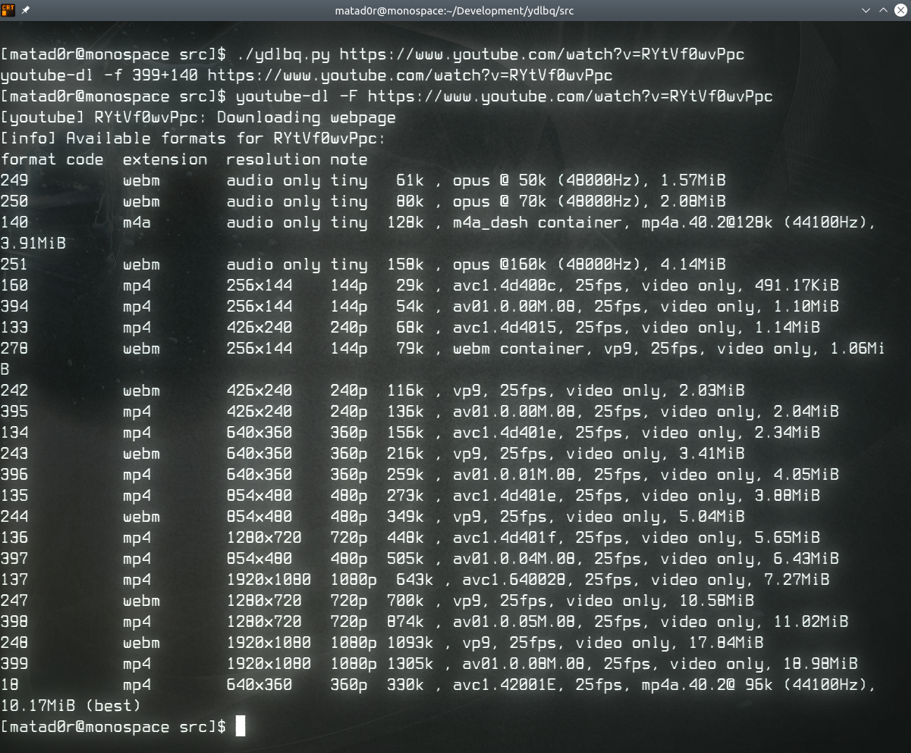
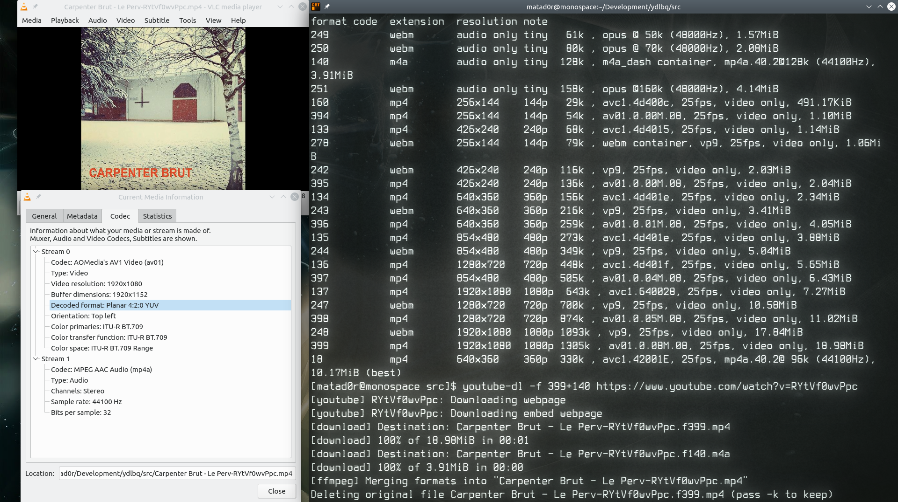
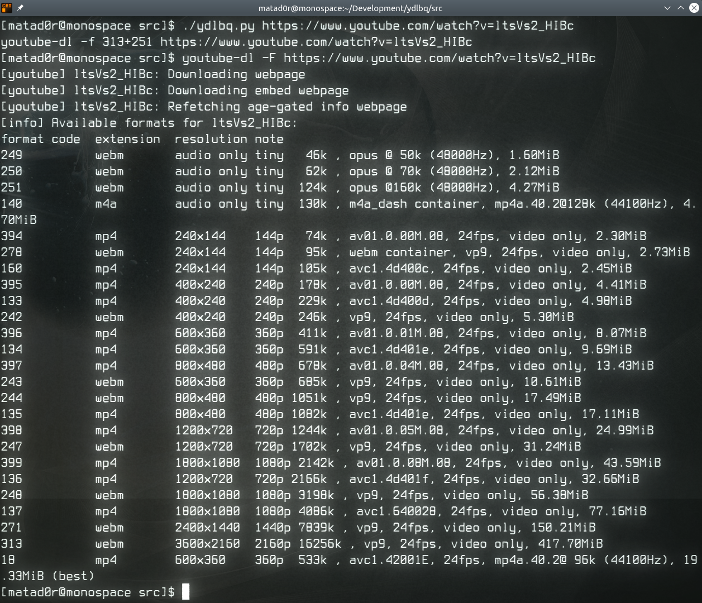
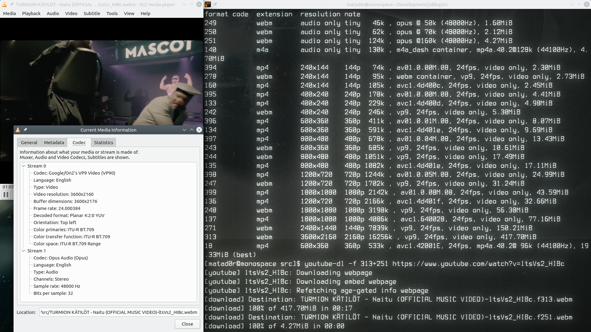
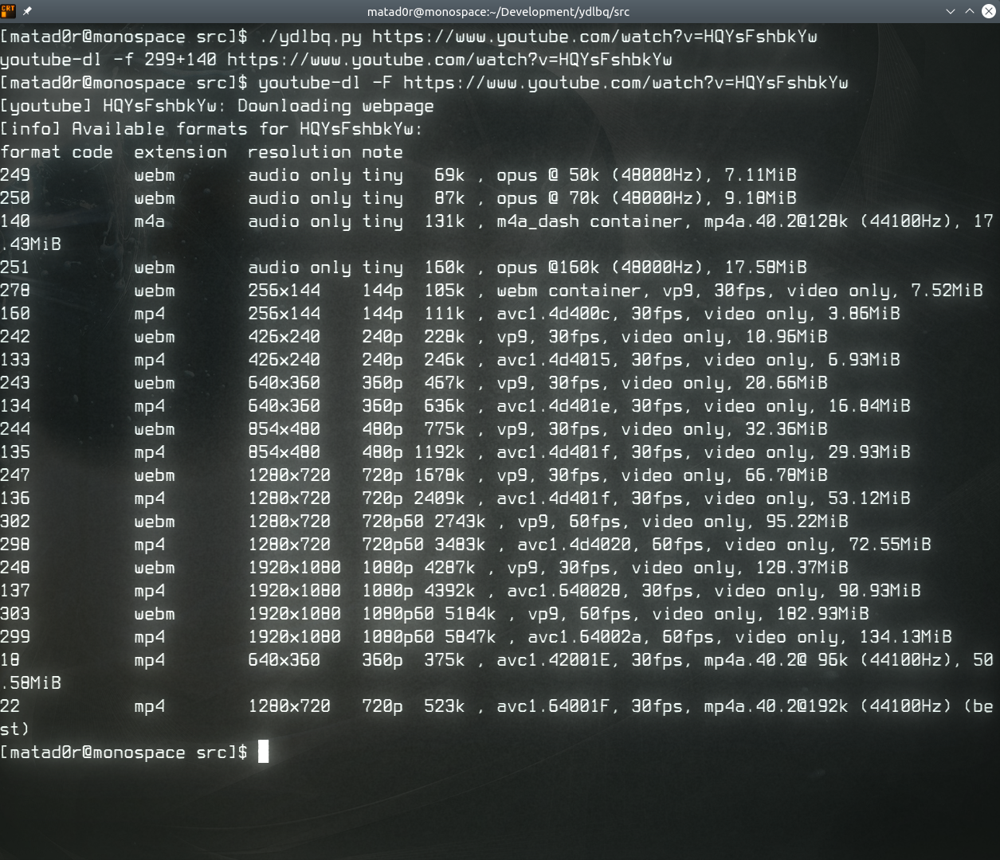
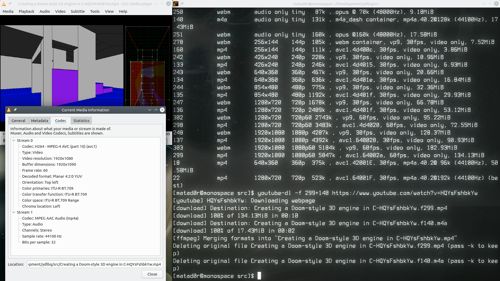
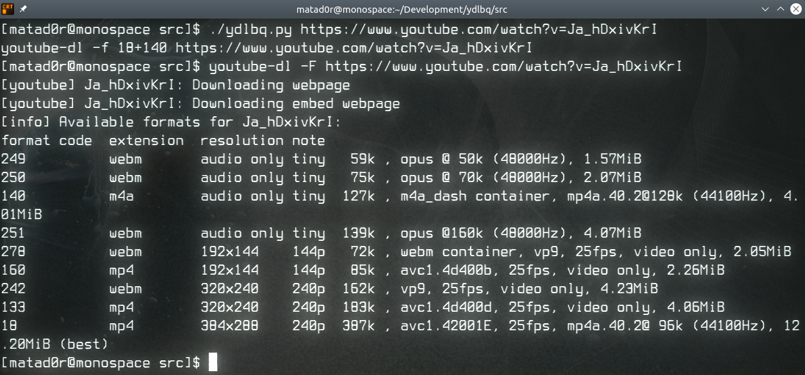
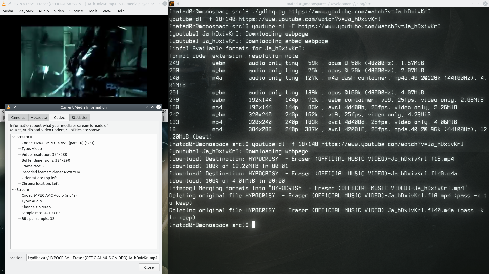
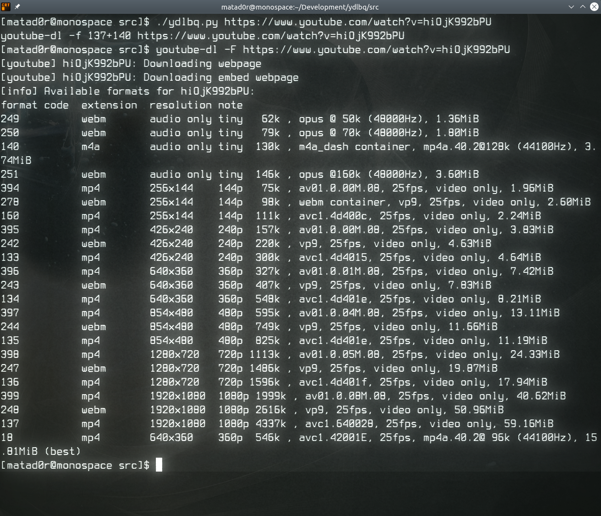

# Tests

## **Let's download a video from around the 2010s!**   
The chosen video is: [Carpenter Brut - Le Perv](https://www.youtube.com/watch?v=RYtVf0wvPpc).

We can see that lot of general format are available for this video but nothing special. 
According to the output, the code for the best video format is **399** and **140** for the best compatible audio format.    
Looking at and running the generated command we can clearly see the script works:

   

## **Let's download a recent YouTube video!**   
The chosen video is: [Turmion Kätilöt - Naitu](https://www.youtube.com/watch?v=ltsVs2_HIBc)  

In this case, we encounter quite a number of modern formats, including ones with 60 FPS.   
Code for the best video format: **313**    
Code for the best audio format: **251**   

## **Let's download a video made by a person and not by a company!**            
The chosen video is: [Bisqwit - Creating a Doom-style 3D engine in C](https://www.youtube.com/watch?v=HQYsFshbkYw)    

Code for the best video format: **299**    
Code for the best audio format: **140**   

## **Let's download a video from 10+ years ago!**
The chosen video is: [Hypocrisy - Eraser](https://www.youtube.com/watch?v=Ja_hDxivKrI)

Code for the best video format: **18**    
Code for the best audio format: **140**   

## **Finally, let's download a video once again from the modern times**
The chosen video is: [Lindemann - Steh Auf](https://www.youtube.com/watch?v=hiOjK992bPU)

Code for the best video format: **137**    
Code for the best audio format: **140**   

