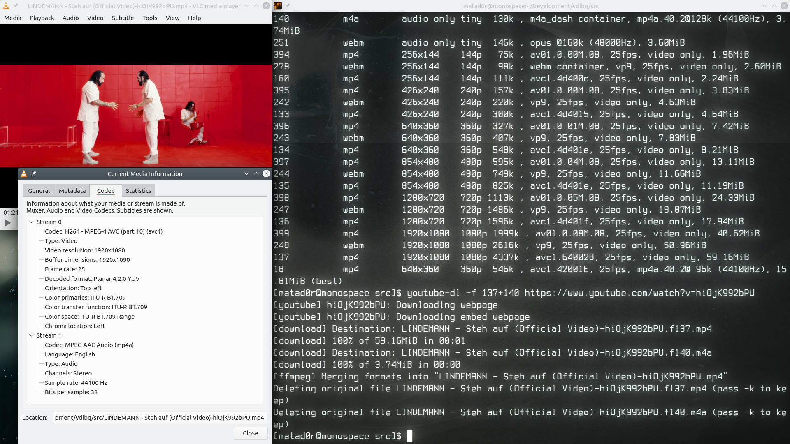

# Tesztek
Bár írtam integrációs teszteket, de még nem töltötttem fel őket..    

## **Először nézzünk meg egy videót 2010-es közepéről!**   
A választott videó [Carpenter Brut - Le Perv](https://www.youtube.com/watch?v=RYtVf0wvPpc).

Elég standard formátumokkal találkozunk, még ekkor nem voltak jelentős a 60 Fps.  
A képről leolvasva látjuk, hogy a legjobb videó kódja **399** és a legjobb kompatibilis audió kódja pedig **140**.    
Lefutattva a generált parancsot láthatjuk, hogy helyes a működés:

   

## **Nézzünk meg egy modern videót!**   
A válaszott videó [Turmion Kätilöt - Naitu](https://www.youtube.com/watch?v=ltsVs2_HIBc) (a finn diszkó jelentős képviselője :))   

Ennél a videónál már találkozhatunk a manapság még nagyon high-end felbontásokkal.   
Legjobb videó kód: **313**    
Legjobb audió kód: **251**   

## **Nézzünk meg egy egyén által feltöltött videót!**      
Bisqwit a YouTube legismertebb és legnagyobbnak tartott programozója.     
A választott videó [Bisqwit - Creating a Doom-style 3D engine in C](https://www.youtube.com/watch?v=HQYsFshbkYw)    

Az előző esethet hasonlóan itt is vannak 60 FPS-s videók.
Legjobb videó kód: **299**    
Legjobb audió kód: **140**   

## **Nézzünk meg egy példát 10+ év ezelőtti videóra!**
A választott videó [Hypocrisy - Eraser](https://www.youtube.com/watch?v=Ja_hDxivKrI)

Legjobb videó kód: **18**    
Legjobb audió kód: **140**   

## **Végül egy utolsót a modernek közül!**
A választot videó [Lindemann - Steh Auf](https://www.youtube.com/watch?v=hiOjK992bPU)

Legjobb videó kód: **137**    
Legjobb audió kód: **140**   

